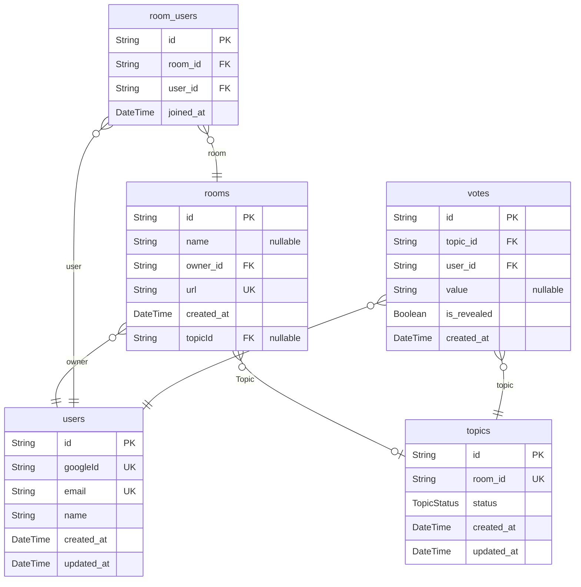

# ER図
> Generated by [`prisma-markdown`](https://github.com/samchon/prisma-markdown)

- [default](#default)

## default

### `users`
Google認証の情報を管理します
ユーザー情報を格納します

**Properties**
  - `id`: 
  - `googleId`: Google認証ID
  - `email`: ユーザーのメールアドレス
  - `name`: ユーザー名
  - `created_at`: 作成日時
  - `updated_at`: 更新日時

### `rooms`
プランニングポーカーの部屋を管理
ルームの情報を格納します

**Properties**
  - `id`: 
  - `name`: 部屋名（オプション）
  - `owner_id`: オーナーID
  - `url`: 部屋へのユニークなURL
  - `created_at`: 作成日時
  - `topicId`: 

### `room_users`
各部屋の参加者を管理
ユーザーと部屋を紐づけます

**Properties**
  - `id`: 
  - `room_id`: 部屋ID
  - `user_id`: ユーザーID
  - `joined_at`: 参加日時

### `topics`

**Properties**
  - `id`: トピックのID
  - `room_id`: 部屋ID
  - `status`: トピックの状態
  - `created_at`: 作成日時
  - `updated_at`: 更新日時

### `votes`

**Properties**
  - `id`: 
  - `topic_id`: 対象のお題のID
  - `user_id`: 投票したユーザーのID
  - `value`: 投票内容 (カードの値: 例 1, 2, 3, "?" など)
  - `is_revealed`: 投票が公開されたかどうか
  - `created_at`: 投票作成日時